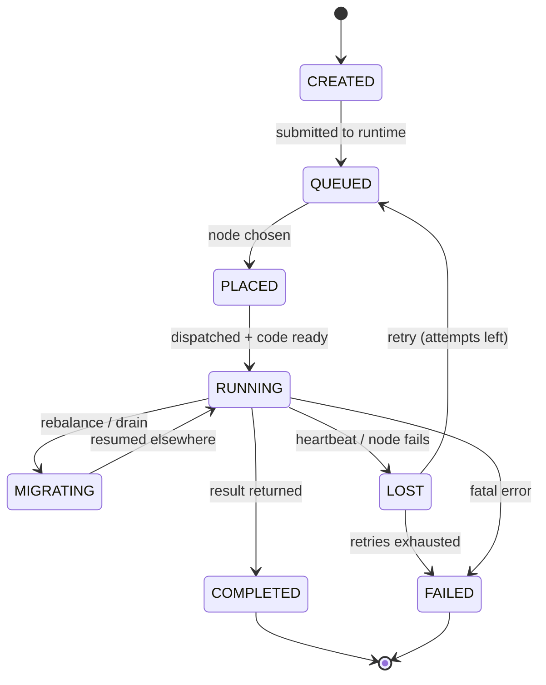
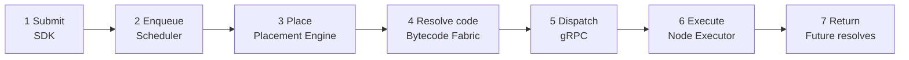
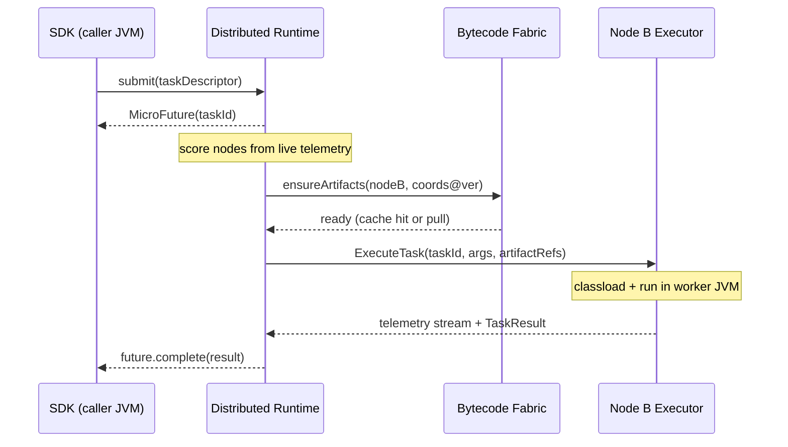
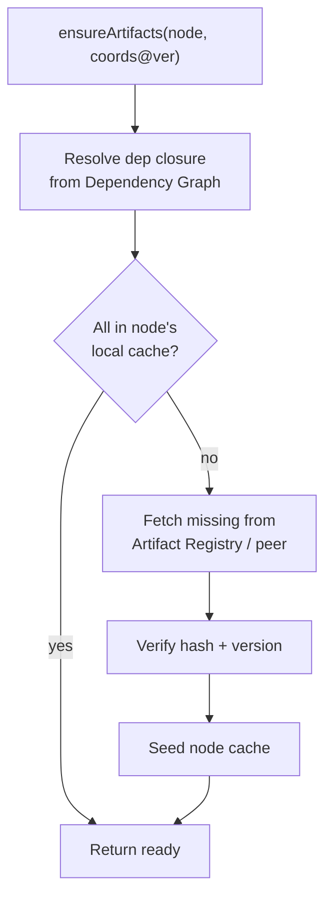
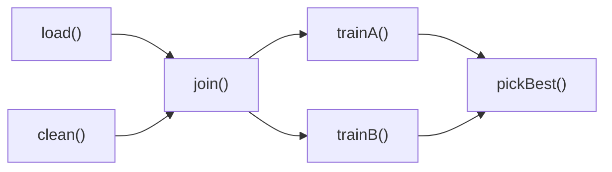
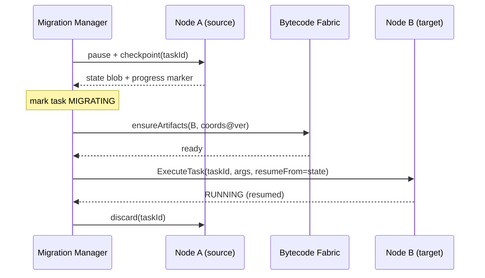
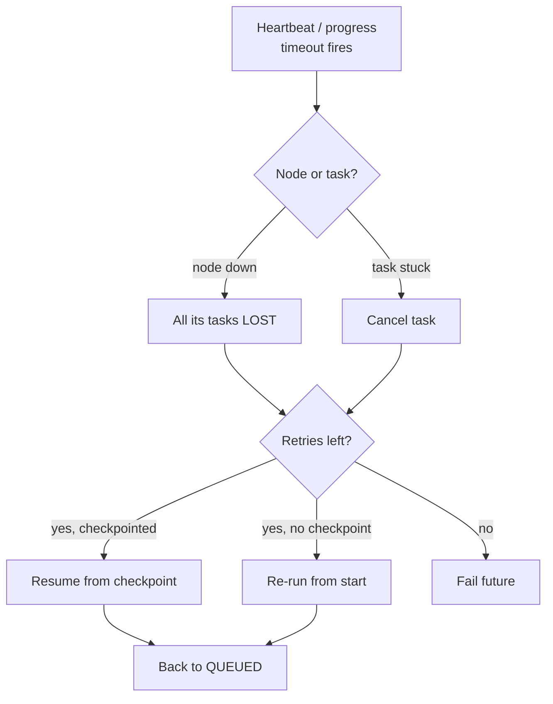

# MicroJVM — End-to-End Execution Flow

2026-09-18 · @ashim.gotame

## Purpose & how to read this

This traces one unit of work — a `MicroTask` — from the moment a developer submits it to the moment its result is available, across a cluster of independent JVMs cooperating over gRPC.

Read it in two passes. The **spine** (Phases A–E) is the minimum viable path: submit, place, resolve code, dispatch, execute, return. Everything after it — DAGs, checkpointing, migration, recovery — is a **layer** that extends the spine without rewriting it.

The design rule underneath every phase: a task is *portable computation*, not shared memory. Nodes never merge heaps. They move versioned bytecode and serialized task state so any node can run any task it holds the code for. "One logical JVM" is an execution illusion built on placement, code locality, and result routing — not a shared address space.

## The cast: one job each per request

Every box in your diagram does exactly one thing on the path of a single task. Keeping these responsibilities disjoint is what lets you build the spine first and add layers later.

| Component | The one job it does per task | Lives where |
| --- | --- | --- |
| **MicroJVM SDK** | Capture the developer's task + inputs as a portable, serializable descriptor; hand back a `MicroFuture` | In the caller's JVM |
| **Distributed Runtime** | Own the task's lifecycle end to end; coordinate the managers below | Control plane (1+ nodes) |
| **Scheduler** | Decide *when* a ready task runs (queueing, priority, backpressure) | Control plane |
| **Placement Engine** | Decide *where* it runs — score candidate nodes from live telemetry | Control plane |
| **Task Manager** | Track each task's state, retries, results, and dependencies | Control plane |
| **Failure Manager** | Detect dead/slow nodes and tasks; trigger recovery | Control plane |
| **Migration Manager** | Checkpoint a running task and move it to another node | Control plane |
| **Node Executor** | Load the code and run the task in a worker JVM; stream telemetry | Every worker node |
| **Bytecode Fabric** | Guarantee the right versioned classes + deps exist on the chosen node | Cluster-wide service + per-node cache |

The control-plane components can start life inside one process and split out later; the wire contract between them (gRPC) is what keeps that refactor cheap.

## Task lifecycle: the state machine

Every task — trivial or migrating across three nodes — moves through the same states. The Task Manager is the single source of truth for which state a task is in.



The spine uses only the top row (`CREATED → QUEUED → PLACED → RUNNING → COMPLETED`); `MIGRATING`, `LOST`, and the retry edges are what the later layers add. Note that `PLACED → RUNNING` is guarded: it cannot fire until the Bytecode Fabric confirms the code is present on the target (Phase C).

## The spine: MVP happy-path at a glance

The minimum viable flow is seven stages: a task is submitted, queued, placed on the best node, its code made available there, dispatched over gRPC, executed, and its result routed back to resolve the caller's future. No DAGs, no migration, no recovery — just one task landing on one good node and coming home.



Stages 1–10 in your original diagram collapse into these seven: the SDK and Runtime cover 1–2, Scheduler + Placement + Fabric cover 3–4, and the Node Executor plus result routing cover 5–7. The next section walks each stage with the actual gRPC calls.

## Happy-path sequence, step by step

Here is the same spine as a call sequence. The caller gets its `MicroFuture` back immediately; everything after is asynchronous.



1. **Submit.** SDK serializes the task descriptor (code coordinates, entry point, args, constraints) and calls `submit`. The Runtime persists it as `CREATED`, returns a future keyed by `taskId`.
2. **Enqueue & place.** Scheduler moves it to `QUEUED`; Placement Engine scores candidate nodes and picks Node B (`PLACED`).
3. **Resolve code.** Runtime asks the Fabric to guarantee Node B has the exact versioned artifacts. A cache hit is instant; a miss triggers a pull before the gate opens.
4. **Dispatch.** Runtime sends `ExecuteTask` to Node B over gRPC with the args and artifact references (`RUNNING`).
5. **Execute.** Node B's executor loads the classes in an isolated classloader, runs the entry point, and streams telemetry back throughout.
6. **Return.** Node B replies with a `TaskResult`; Runtime marks `COMPLETED` and completes the caller's future with the value (or an exception).

## Phase A — Submission & task capture (SDK)

The SDK's job is to turn an ordinary Java computation into a *self-describing, portable descriptor* that any node can later reconstruct and run. Nothing leaves the caller until this descriptor is complete.

The developer expresses work as a `MicroTask<T>` — a `Callable`-like unit with its inputs — and gets a `MicroFuture<T>` in return. Under the hood the SDK builds a descriptor:

| Field | What it carries | Why placement/fabric needs it |
| --- | --- | --- |
| `taskId` | Cluster-unique id | Correlates future, telemetry, result |
| `codeCoordinates` | Artifact group:name:version + entry class/method | Fabric resolves exact bytecode |
| `args` | Serialized inputs (bytes) | Shipped to the chosen node |
| `constraints` | CPU/heap hints, GPU/native needs, affinity, priority | Placement scoring |
| `dependencies` | Upstream `taskId`s (empty for a leaf) | DAG ordering (later layer) |
| `resultSpec` | Return by value vs by reference | Result routing |

Two decisions matter here. First, **how args and results serialize** — pick one scheme (e.g. protobuf for control messages, a pluggable codec for payloads) so any node can decode. Second, **code is referenced, never inlined**: the descriptor names artifact coordinates, and the Fabric (Phase C) does the shipping. The SDK then calls `submit` and hands the developer a future that is not yet resolved.

## Phase B — Placement decision

Placement answers one question: *of the nodes that could run this task, which one should?* The Scheduler decides admission and ordering; the Placement Engine scores nodes and picks the winner. This is where MicroJVM earns the word "intelligent."

Each node continuously reports a health/capability snapshot (Phase D streams it). The Placement Engine keeps the latest snapshot per node and computes a fitness score:

| Signal | Read as | Effect on score |
| --- | --- | --- |
| CPU load, run-queue depth | Spare compute | Lower load scores higher |
| Heap free + GC pause/frequency | Memory headroom | Near-OOM or GC-thrashing nodes penalized |
| Live thread count vs pool | Concurrency slack | Saturated pools penalized |
| JIT warmness for these classes | Steady-state speed | A node already warm on this code scores higher |
| Artifact locality | Code already cached | Avoids a Fabric pull — big bonus |
| Data locality | Inputs already resident | Avoids shipping large args |
| Hardware caps | GPU / native / arch match | Hard filter, then bonus |
| Network RTT to caller/data | Transfer cost | Farther nodes penalized |
| Historical perf for this task type | Learned suitability | Tie-breaker / prior |

A workable v1 score is a weighted sum over normalized signals, with hardware needs applied first as a hard filter:

```
candidates = nodes.filter(hardwareRequirementsMet)
score(n)  = w_cpu*cpuFree(n) + w_mem*heapFree(n) - w_gc*gcPressure(n)
          + w_loc*artifactLocal(n) + w_data*dataLocal(n)
          + w_jit*jitWarm(n, classes) - w_net*rtt(n) + w_hist*history(n, taskType)
target    = argmax(score) over candidates
```

The task moves to `PLACED` bound to `target`. Weights start as constants you tune; the historical-performance term is the natural hook for making placement adaptive later. If no candidate passes the hard filter, the task stays `QUEUED` (backpressure) rather than failing.

## Phase C — Bytecode & artifact resolution

The Fabric guarantees an invariant: *a task never starts on a node that lacks its exact, versioned code and dependencies.* This is the gate on `PLACED → RUNNING`.

Given the descriptor's `codeCoordinates`, the Runtime calls `ensureArtifacts(nodeB, coords@version)`. The Fabric resolves the full dependency closure, then makes each artifact present on the target:



Four responsibilities make this work. The **Artifact Registry** is the content-addressed store of published jars/classes keyed by `group:name:version` plus a content hash. **Versioning** means immutable coordinates — the same coordinate always yields identical bytes, so caches never go stale and two nodes can't disagree on what `v1.3.0` is. The **Dependency Graph** lets the Fabric resolve the transitive closure once and ship only what's missing. The **Distributed Cache** is the per-node (and peer-to-peer) layer that turns the common case into a hit, and lets a node pull a hot artifact from a nearby peer instead of the central registry.

Because coordinates are immutable and content-hashed, artifact locality can feed straight back into placement (Phase B): the Fabric already knows which nodes hold which artifacts, so the Placement Engine can prefer them and skip this pull entirely.

## Phase D — gRPC dispatch & remote execution

With code guaranteed present, the Runtime dispatches. The Node Executor is a gRPC server on every worker; the Runtime is its client. A minimal contract:

```proto
service NodeExecutor {
  rpc ExecuteTask(ExecuteRequest) returns (stream TaskEvent);
  rpc CancelTask(TaskId) returns (Ack);
  rpc ReportHealth(Empty) returns (stream NodeSnapshot);
}
```

`ExecuteTask` returns a *stream* of `TaskEvent`s — telemetry, logs, partial progress, and finally the `TaskResult` — so the caller sees liveness, not just a terminal reply. On receiving `ExecuteRequest(taskId, entry, args, artifactRefs)` the executor:

1. **Resolves a classloader** for the artifact set. Each task (or artifact version) runs in an isolated child classloader so two versions of a library can coexist in one JVM without collision.
2. **Deserializes args** with the agreed codec and binds them to the entry point.
3. **Runs the task** on a managed worker pool, wrapped so uncaught exceptions become a typed `TaskEvent`, not a dead thread.
4. **Streams telemetry** — CPU, heap, GC, thread, JIT snapshots — on `ReportHealth` continuously and per-task counters on the `ExecuteTask` stream. This is the same feed Phase B scores on.
5. **Emits the result** as the stream's final event; the executor then releases the classloader and pool slot.

Two things to get right early: make `ExecuteTask` **idempotent by `taskId`** (a retried dispatch must not double-run), and keep the executor **stateless about task meaning** — it runs whatever bytecode it's handed, which is exactly what makes computation portable across nodes.

## Phase E — Result, futures & completion

The final event on the `ExecuteTask` stream carries the outcome. The Runtime records it, marks the task `COMPLETED` (or `FAILED`), and resolves the caller's `MicroFuture`.

How the result travels depends on `resultSpec`. **By value** — small results — the bytes ride back on the stream and the future completes with the deserialized value. **By reference** — large results, or results another task will consume — the node keeps the value in local (or fabric-backed) storage and returns a handle; the value is fetched only when someone actually reads it, and the handle doubles as a data-locality hint for placing the consumer. Failures propagate the same way: the terminal event carries a typed error, and the future completes exceptionally so the caller sees a normal Java exception.

Completion is also bookkeeping. The Task Manager releases the slot, records actual runtime and resource use against this task type (feeding Phase B's historical term), and — once no dependent task still needs it — lets by-reference results be garbage-collected. At this point the spine is complete: one task submitted, placed, run on the best node, and its result home. Everything below extends this without changing it.

## Layer up — DAGs, parallelism & distributed futures

The spine already handles one task. A DAG is just *many tasks whose args are each other's futures.* Nothing in Phases A–E changes; the Runtime gains a graph it walks.

When a task's `args` include a `MicroFuture` produced by another task, the SDK records a dependency edge instead of a value. The Task Manager holds the task in `CREATED` until every upstream future resolves, then releases it to `QUEUED`. Independent tasks with no pending edges are placed concurrently — that is your parallelism, for free.



Two properties fall out of doing it this way. **Fan-out/fan-in** is automatic: `join` waits on two upstreams, `pickBest` waits on two models, and the scheduler runs `trainA`/`trainB` on different nodes at once. **Distributed futures compose**: a future can be passed to another task without its value ever returning to the caller — combined with by-reference results (Phase E), an intermediate can be produced on one node and consumed on another with the caller never touching the bytes. The Placement Engine uses the edges as data-locality hints: place a consumer near where its input already lives.

## Layer up — checkpointing & task migration

Migration moves a *running* task to a better node — because the current one is degrading, being drained, or a much better node appeared. It rests entirely on checkpointing: a task that can serialize its progress can be resumed anywhere its code exists.

The honest constraint: the JVM can't snapshot an arbitrary running thread stack portably. So MicroJVM asks tasks to be *checkpointable* — long-running tasks expose their state through a `Checkpointable` interface (or are structured as resumable steps), and the executor snapshots that state, not raw stack frames. Short tasks aren't migrated; they're just re-run on failure (next layer).



Three guarantees keep this safe. The task is **paused before it's copied** so state can't change mid-snapshot. It's **idempotent on resume** — the target continues from the marker rather than restarting side effects, which is why `ExecuteTask` keys on `taskId`. And the **source is discarded only after** the target confirms `RUNNING`, so a mid-migration crash falls back to re-running from the last checkpoint. The caller's future is untouched — it still points at `taskId`, now living on Node B.

## Layer up — failure detection & recovery

The Failure Manager watches two things: are nodes alive, and are tasks making progress? The `ReportHealth` stream doubles as a heartbeat — a node that stops streaming past a deadline is suspect, and a task emitting no progress events past its budget is stuck.

Recovery depends on the failure class, because they need different responses:

| Failure class | Detected by | Response |
| --- | --- | --- |
| Node crash / partition | Heartbeat gap | Mark node down; all its tasks → `LOST` → re-place |
| Task fatal exception | Typed terminal event | `FAILED`; retry only if declared retryable |
| Task hang / no progress | Progress-event timeout | Cancel + re-place (or migrate from last checkpoint) |
| Slow node (degrading) | Fitness score decay | Drain: stop new tasks, migrate running ones |



Two principles make recovery correct rather than just automatic. **Idempotency is the whole game**: re-placing a `LOST` task is only safe because dispatch keys on `taskId` and tasks are written to tolerate re-execution — the same property migration relies on. And **recovery reuses the spine**: a recovered task re-enters at `QUEUED` and flows through placement, fabric, and dispatch exactly like a new one, with its attempt counter incremented. There is no separate recovery pipeline to maintain — only new entry points into the path you already built.

## Build order & first milestone

Build the spine end to end before any layer, and prove portability first. The thinnest thing worth having: **submit a task from one JVM, run it on a second JVM over gRPC, and get the result back** — hardcode the target node, ship code as a plain jar reference, no scoring. If that works, the hard idea (portable computation) is proven and everything else is additive.

| # | Milestone | Proves | Deliberately faked |
| --- | --- | --- | --- |
| 1 | SDK descriptor + `submit` → `MicroFuture`; gRPC `ExecuteTask`; run on a fixed remote node | Portable execution over the wire | Placement (hardcoded), fabric (shared jar), telemetry |
| 2 | Node Executor: isolated classloader + arg/result codec + idempotent dispatch | Any node runs any handed bytecode safely | — |
| 3 | Bytecode Fabric: registry + immutable versioned coords + per-node cache | Code locality; no shared filesystem | Peer-to-peer pull, dep-graph pruning |
| 4 | Telemetry stream + Placement Engine weighted score | "Intelligent" placement | Historical/learned term |
| 5 | Task Manager as state store + DAG edges on futures | Parallelism & fan-in/out | — |
| 6 | Failure Manager: heartbeats + retry of `LOST`/`FAILED` (idempotent re-place) | Survives node loss | Checkpointed resume |
| 7 | Checkpointing + Migration Manager | Move running work; drain nodes | — |

The order is deliberate: milestones 1–3 are the spine, 4–5 make it smart and composable, 6–7 make it resilient. Each milestone is demoable on its own, and none forces you to rework an earlier one — because the gRPC contract and the `taskId`-keyed, idempotent dispatch are fixed from milestone 1. The single most important early investment is **idempotency and immutable artifact versioning**; retries, migration, and recovery all quietly depend on them, and retrofitting either later is painful.
